# Healthpoint - Digital Healthcare Platform (MERN Stack)

A comprehensive, responsive Healthcare Management Web Application that provides complete healthcare solutions including medicine purchasing, doctor appointments, blood donation management, and emergency services. Built using the **MERN Stack** (MongoDB, Express.js, React.js, Node.js) with modern UI and secure payment integration.

---

## Problem Statement

During emergencies and pandemics, accessing reliable healthcare information and services becomes critical. Many people struggle to find comprehensive healthcare platforms that offer medicine delivery, doctor consultations, blood donation services, and emergency support in one place. Traditional healthcare systems often lack digital integration, making it difficult for patients to access timely care and information.

---

## Background and Motivation

In the event of a pandemic, everyone must rely on digital healthcare solutions. Online platforms often fail to provide comprehensive health-related information and services, especially in developing countries like Bangladesh. This project addresses the gap by creating a unified healthcare platform that enables:

- **Digital Healthcare Management**: Electronic management of health information for safer, more efficient healthcare delivery
- **Emergency Response**: Quick access to medical services during critical situations
- **Comprehensive Services**: One-stop solution for medicines, doctors, blood donation, and emergency care
- **Better User Experience**: Intuitive interface designed for all age groups and technical backgrounds

---

## Objectives

* Create a user-friendly healthcare ecosystem that makes medical services equitable and accessible
* Develop a comprehensive information system that enhances quality of life for everyone
* Provide full online support for medical environment management
* Enable emergency protocol compliance and online medicine purchasing
* Facilitate easy access to doctor information and appointment booking
* Implement efficient ambulance and blood management systems
* Enable fast and remote healthcare monitoring capabilities

---

## Tech Stack

| Tool/Tech        | Purpose                                    |
| ---------------- | ------------------------------------------ |
| **MongoDB**      | NoSQL database for storing healthcare data |
| **Express.js**   | Backend web framework for API logic        |
| **React.js**     | Frontend JavaScript library for UI         |
| **Node.js**      | Backend runtime environment                |

| **PayPal**       | Global payment processing                  |
| **Gmail API**    | Account verification and password reset    |

---

## Installation Guide

### 1. Clone the Repository

```bash
git clone https://github.com/pavankalyan369/Digital-Healthcare-Platform-Healthpoint-MERN.git
```

### 2. Install Backend Dependencies

```bash
cd eHealth-Mern-
npm install
```

### 3. Install Frontend Dependencies

```bash
cd client
npm install
```

### 4. Environment Setup

Create a `.env` file in the root directory with the following:

```env
MONGO_URI=<your_mongo_uri>
PORT=5000
GMAIL_USER=<your_gmail_for_verification>
GMAIL_PASS=<your_gmail_app_password>
PAYPAL_CLIENT_ID=<your_paypal_client_id>
PAYPAL_CLIENT_SECRET=<your_paypal_secret>
JWT_SECRET=<your_jwt_secret>
```

> You can get your MongoDB URI by creating a free cluster on [MongoDB Atlas](https://www.mongodb.com/cloud/atlas).

---

## Running the Project Locally

### Start Backend Server

```bash
npm run server
```

### Start Frontend React App

```bash
cd client
npm start
```

Now, navigate to: [http://localhost:3000](http://localhost:3000)

---

## Core Features

### **User Management**
* User registration with email verification
* Secure login system with password reset functionality
* Profile management and order history tracking

### **Medicine Services**
* Browse comprehensive medicine catalog with detailed information
* Add medicines to cart with quantity selection
* Apply promo codes for discounts
* Secure checkout with address and payment method selection
* Dual payment options: AamarPay (Bangladesh) and PayPal (Global)
* Post and read medicine reviews

### **Doctor Services**
* View detailed doctor profiles and specializations
* Book appointments with preferred doctors
* Select appointment dates and provide patient information
* Appointment confirmation and management system

### **Blood Donation Platform**
* Smart search and filter system for blood donors
* Emergency blood request functionality
* Donor registration and profile management
* Real-time availability tracking

### **Communication**
* Live chat with administrators for support
* Query resolution regarding doctors and services

### **Administrative Controls**
* Comprehensive order management system
* Medicine, doctor, and donor data management (CRUD operations)
* User management and verification
* Appointment, order, and blood request approval system
* SEO-optimized category pages
* Complete transaction and interaction history

---

## Interface Snapshots

### Interface
  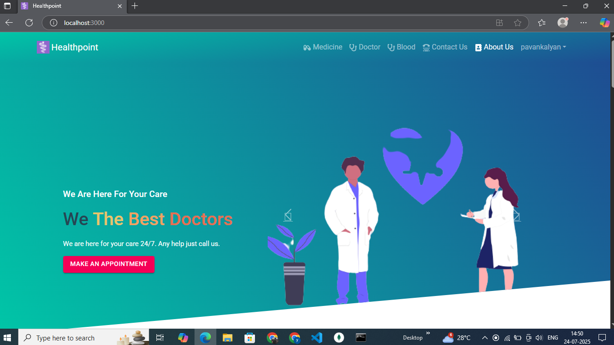
  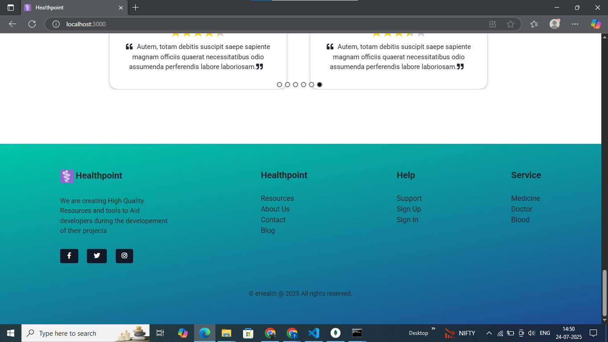
  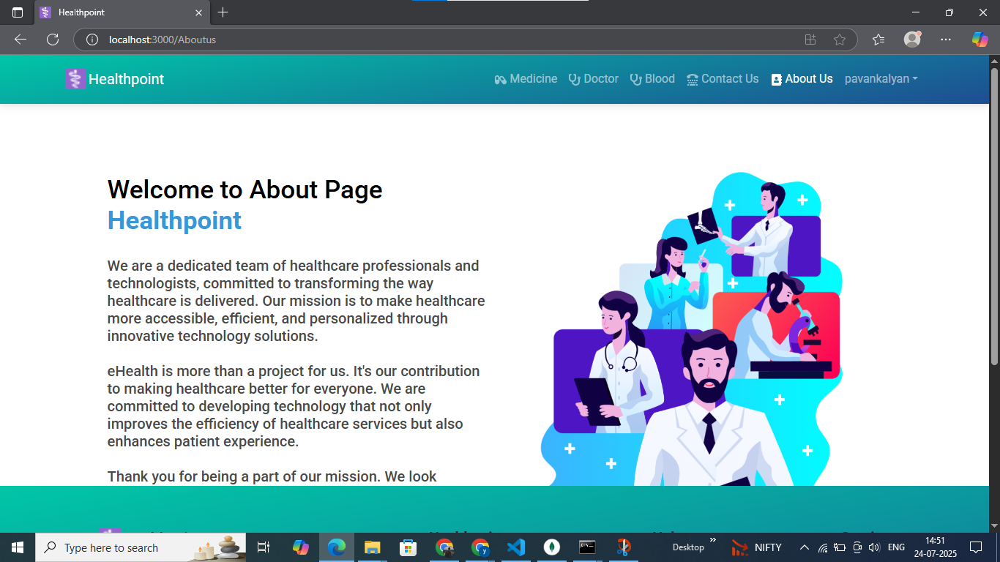

  
### User Authentication
  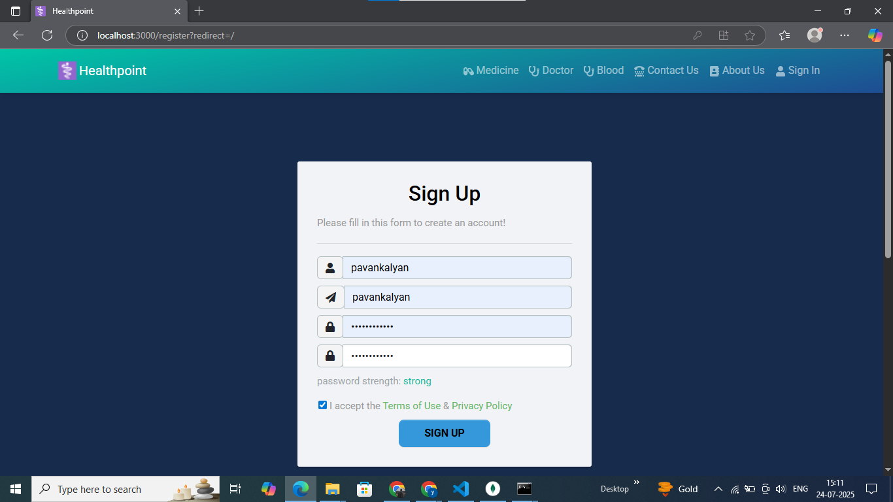
  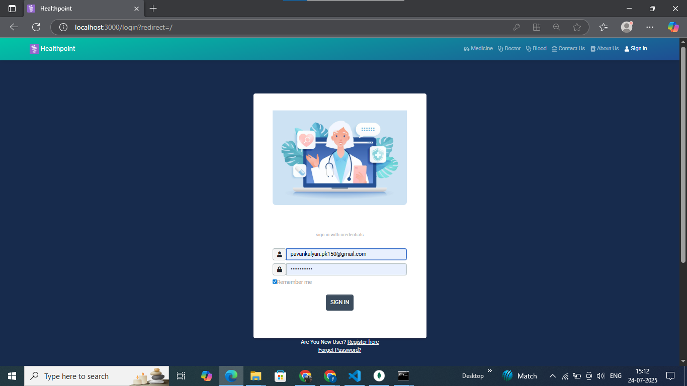

### Medicine Services
<p align="center">
  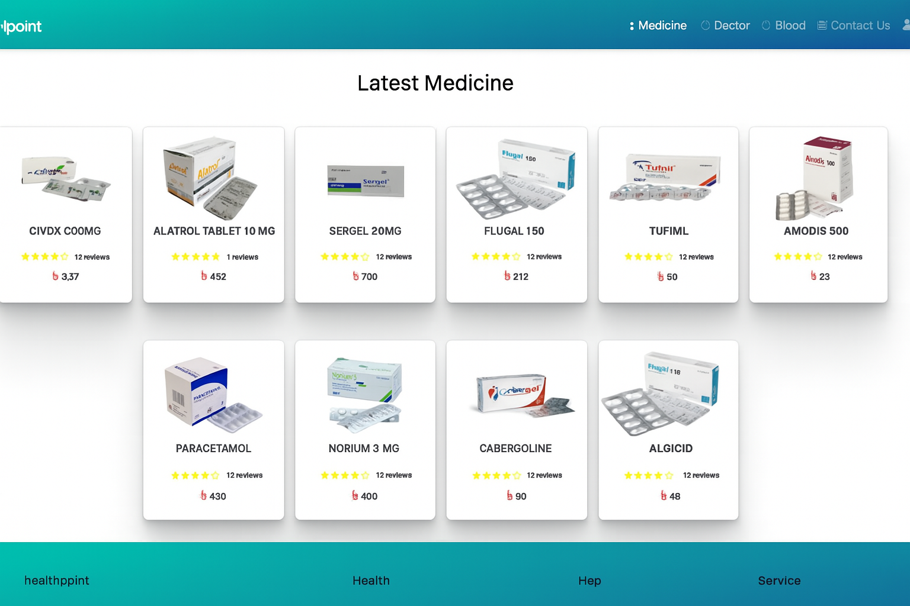
  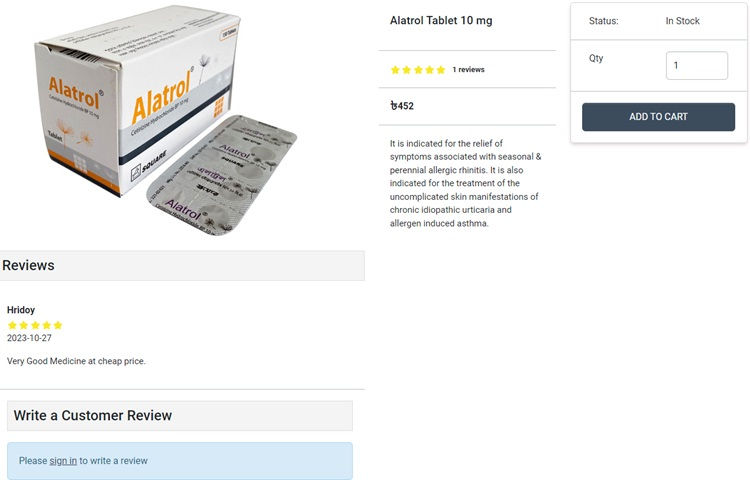
</p>


### Doctor Services
<p align="center">
  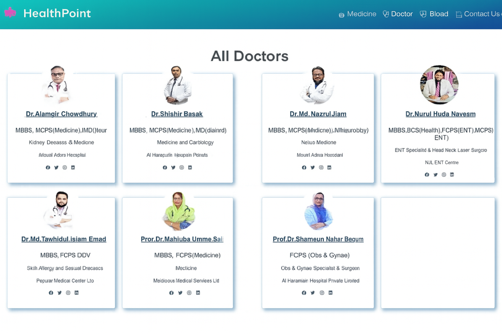
  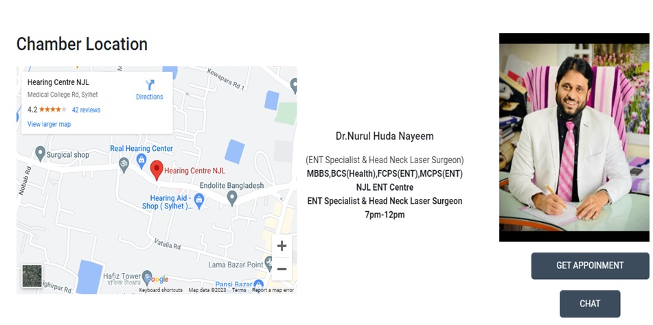
</p>

### Appointment Services
<p align="center">
  
  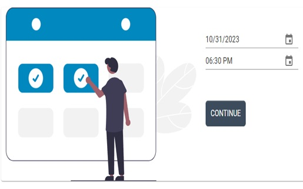
</p>

### Blood Donation Platform
<p align="center">
  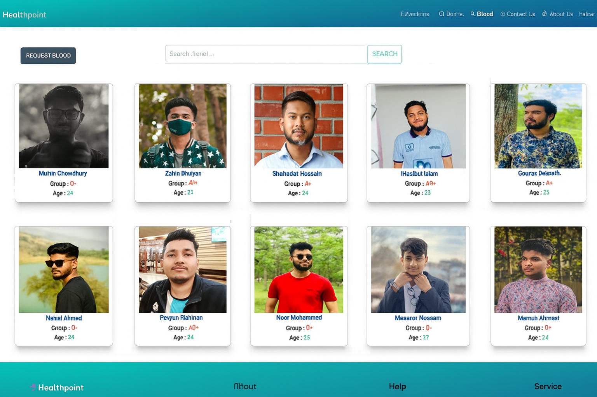
  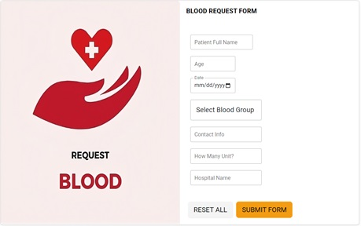
   
</p>

### Administrative Dashboard
  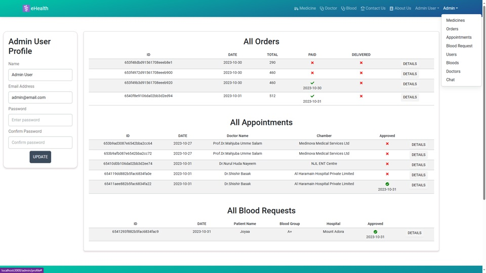
  

### User Profile
  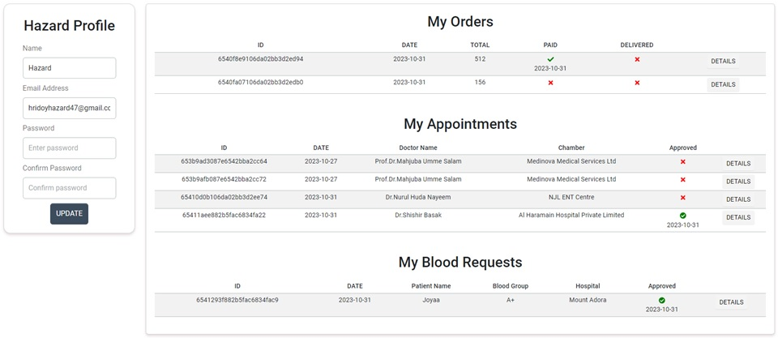


---

## Project Structure

```bash
eHealth-Mern-/
│
├── client/                     # React Frontend
│   ├── public/
│   └── src/
│       ├── components/         # Reusable UI Components
│       ├── pages/              # Routes & Pages
│       ├── context/            # State Management
│       └── App.js              # Root Component
│
├── config/
│   └── db.js                   # MongoDB connection setup
│
├── models/
│   ├── User.js                 # User schema
│   ├── Medicine.js             # Medicine schema
│   ├── Doctor.js               # Doctor schema
│   ├── Appointment.js          # Appointment schema
│   ├── BloodDonor.js           # Blood donor schema
│   └── Order.js                # Order schema
│
├── routes/
│   ├── userRoutes.js           # User authentication routes
│   ├── medicineRoutes.js       # Medicine management routes
│   ├── doctorRoutes.js         # Doctor management routes
│   ├── appointmentRoutes.js    # Appointment routes
│   ├── bloodRoutes.js          # Blood donation routes
│   └── paymentRoutes.js        # Payment processing routes
│
├── controllers/
│   ├── userController.js       # User management logic
│   ├── medicineController.js   # Medicine operations
│   ├── doctorController.js     # Doctor operations
│   ├── appointmentController.js # Appointment handling
│   ├── bloodController.js      # Blood donation logic
│   └── paymentController.js    # Payment processing
│
├── middleware/
│   ├── auth.js                 # Authentication middleware
│   └── admin.js                # Admin authorization
│
├── utils/
│   ├── email.js                # Email service utilities
│   └── payment.js              # Payment gateway integration
│
├── .env                        # Environment variables
├── server.js                   # Entry point for backend
└── package.json
```

---

## Key Benefits

* **Comprehensive Healthcare Solution**: All-in-one platform for medical needs
* **Emergency Ready**: Quick access to blood donors and emergency services
* **Secure Transactions**: Multiple payment gateways with secure processing
* **User-Friendly Interface**: Intuitive design suitable for all demographics
* **Scalable Architecture**: Built to handle growing user base and features
* **Mobile Responsive**: Optimized for all devices and screen sizes
* **SEO Optimized**: Better visibility and accessibility

---

## Future Improvements

* Telemedicine integration for virtual consultations
* AI-powered symptom checker and health recommendations
* Integration with wearable devices for health monitoring
* Multilingual support for better accessibility
* Mobile app development (React Native)
* Insurance claim processing integration
* Prescription management system
* Health record digitization and management

---

---

---

## Acknowledgments

* Healthcare professionals who provided insights for feature development
* Open source community for various libraries and tools
* Beta testers who helped improve the user experience
